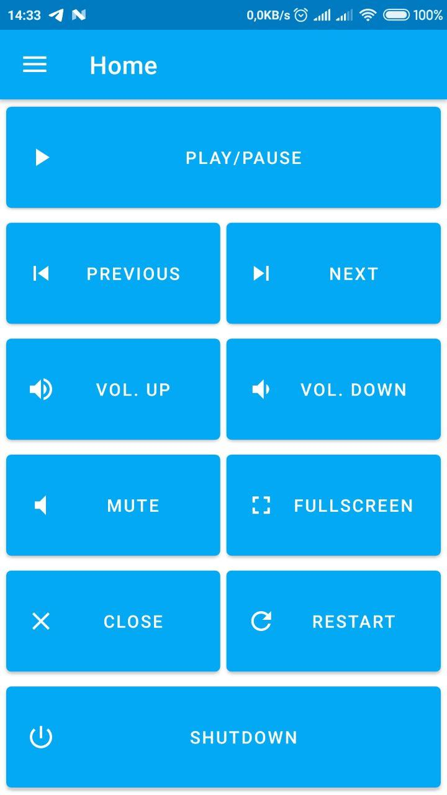

# SSleepy App Android
Application to control Windows remotely with Android.

<p align="center">
  
</p>

# Features
* Shutdown
* Restart
* Play
* Pause
* Next
* Previous
* Volume Up
* Volume Down
* Mute
* Close
* Fullscreen
* Mouse
* Left Click
* Right Click

# Prerequisites
* [SSleepy Server](https://github.com/xxgicoxx/ssleepy-server)
* [Android Studio](https://developer.android.com/studio/?gclid=CjwKCAjwzIH7BRAbEiwAoDxxTlrgZkmyizEw2L4qu6vmLIn4teX-87ir1-rnV_lOYI8Pfj6X65JOfBoCMBIQAvD_BwE&gclsrc=aw.ds)

# Running
### Run
````
# Import Project on Android Studio
Open an existing Android Studio project > SSleepy.

# Start
Run > Run 'app'.
````

# Built With
* [Java](https://www.java.com/pt_BR/)

# Authors
* [xxgicoxx](https://github.com/xxgicoxx)

# Acknowledgments
* [FlatIcon](https://www.flaticon.com/)
* [Material](https://material.io/resources/icons/)